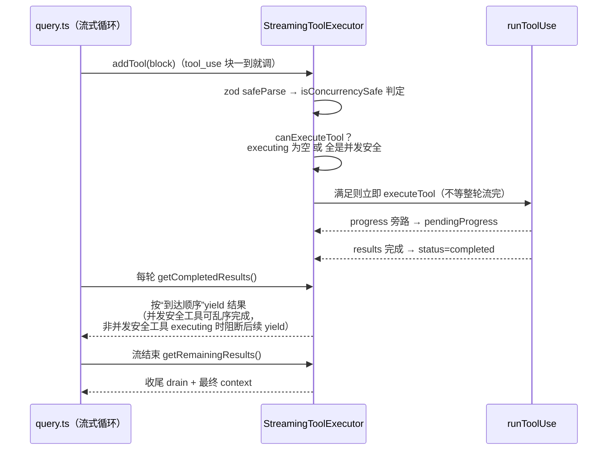

# Claude Code 工具系统架构分析（对标 nexus-agent）

> 分析对象：`D:\claude code`（cc-haha v0.6.3）。其 `src/` 是 Claude Code CLI 引擎的内部代码分叉（保留 `tengu_*` Statsig 开关、`USER_TYPE==='ant'` 分支、`bun:bundle` 编译期 `feature()` 死代码消除等上游痕迹），因此可视为 **Claude Code 工具系统的第一手参考实现**。
> 本文目的：吃透其工具系统架构，逐维度对照 nexus-agent（`D:\Agent`）现状，给出对齐优先级。
> 分析日期：2026-09-19。

---

## 0. 核心文件清单

| 层 | 文件 | 行数 | 职责 |
|---|---|---|---|
| 定义 | `src/Tool.ts` | 794 | `Tool` 接口、`buildTool()` 默认值工厂、`ToolUseContext`、`ToolPermissionContext` |
| 装配 | `src/tools.ts` | 403 | 工具注册中心：全量清单、条件装配、权限过滤、内置+MCP 合并 |
| 实现 | `src/tools/*`（约 50 目录） | — | 每工具一个目录：`Tool.ts` + `UI.tsx` + `prompt.ts` + `types.ts` + `utils.ts` |
| 编排 | `src/services/tools/toolOrchestration.ts` | 189 | 非流式路径：分批（并发/串行）+ 并发池 |
| 编排 | `src/services/tools/StreamingToolExecutor.ts` | 531 | 流式路径：边到达边执行、按序 yield、兄弟级联 abort |
| 执行 | `src/services/tools/toolExecution.ts` | 1745 | 单工具完整管线：zod 校验→语义校验→hooks→权限→call→结果 |
| 执行 | `src/services/tools/toolHooks.ts` | — | PreToolUse/PostToolUse hook 执行与权限决定合成 |
| 序列化 | `src/utils/api.ts`（`toolToAPISchema`） | ~260 | zod→JSON Schema、会话级 schema 缓存、`defer_loading` 标志 |
| 序列化 | `src/utils/zodToJsonSchema.ts` | 23 | zod v4 原生 `toJSONSchema()` + WeakMap 身份缓存 |
| 结果 | `src/utils/toolResultStorage.ts` | 1040 | 工具结果磁盘溢写、内容替换预算（content replacement budget） |
| 延迟加载 | `src/tools/ToolSearchTool/` | 471+ | 延迟工具发现：`select:` 精确 / 关键词 / `+require` 三种查询 |

---

## 1. 总体架构图

```mermaid
flowchart TB
    subgraph DEF["① 定义层  src/Tool.ts + src/tools/*"]
        direction LR
        TOOL_IF["Tool 接口（约 40 个成员）<br/>标识/发现 · 执行 · schema · 安全调度标志<br/>权限 · UI 渲染 · 观测"]
        BUILD["buildTool(def)<br/>TOOL_DEFAULTS 补默认值<br/>（fail-closed）"]
        TOOL_IMPL["约 50 个工具实现<br/>FileEditTool / BashTool / AgentTool / WorkflowTool...<br/>每工具一目录：Tool.ts + UI.tsx + prompt.ts + types.ts"]
        TOOL_IMPL --> BUILD --> TOOL_IF
    end

    subgraph ASM["② 装配层  src/tools.ts"]
        GAB["getAllBaseTools()<br/>全量清单；feature()/env/isEnabled 条件装配<br/>（编译期死代码消除）"]
        GT["getTools(permCtx)<br/>deny 规则前置过滤 → 模型看不到被禁工具"]
        ATP["assembleToolPool(permCtx, mcpTools)<br/>内置+MCP 去重合并；分区排序<br/>保 prompt-cache 稳定前缀"]
        GAB --> GT --> ATP
    end

    subgraph SER["③ 序列化层  utils/api.ts + zodToJsonSchema.ts"]
        Z2J["zod v4 toJSONSchema()<br/>WeakMap 按 schema 身份缓存"]
        TAS["toolToAPISchema()<br/>会话级缓存（防 schema 字节漂移）<br/>description = tool.prompt() 动态生成"]
        DEFER["defer_loading: true<br/>shouldDefer 工具只发名字<br/>ToolSearch 按需取全 schema"]
        Z2J --> TAS --> DEFER
    end

    subgraph EXE["④ 执行层  query.ts → services/tools/*"]
        direction TB
        STE["StreamingToolExecutor（流式主路径）<br/>边到达边执行 · 结果按到达序 yield<br/>queued/executing/completed/yielded 状态机"]
        ORCH["runTools（非流式路径）<br/>partitionToolCalls：连续并发安全批 +<br/>写操作独占串行批；并发池默认 10"]
        RTU["runToolUse → checkPermissionsAndCallTool<br/>单工具九步管线（见 §4）"]
        STE --> RTU
        ORCH --> RTU
    end

    subgraph RES["⑤ 结果与渲染层"]
        TRS["toolResultStorage<br/>超限磁盘溢写 + 内容替换预算"]
        MAP["mapToolResultToToolResultBlockParam<br/>Output → API tool_result 块"]
        REN["renderToolUseMessage / renderToolResultMessage<br/>renderToolUseProgressMessage / renderGroupedToolUse<br/>Ink/桌面/SDK 三端复用"]
        TRS --> MAP --> REN
    end

    DEF -->|Tools 数组| ASM -->|Tools| SER
    SER -->|"API tools[]（含 defer 标志）"| EXE
    EXE -->|ToolResult{data,...}| RES
    RES -->|"tool_result 回填 messages"| EXE
```

**关键认知**：工具系统不是一个注册表，而是**五层各自带缓存与稳定性约束的流水线**。定义层产出能力单元，装配层按权限/环境裁剪，序列化层保证发给 API 的字节稳定（prompt cache 命中的前提），执行层管并发与安全闸门，结果层管 token 预算与三端渲染。

---

## 2. 定义层：`Tool` 接口与 `buildTool`

### 2.1 接口成员分组（`src/Tool.ts:364-697`）

| 分组 | 成员（节选） | 说明 |
|---|---|---|
| 标识/发现 | `name`、`aliases?`、`searchHint?`、`isMcp?`、`mcpInfo?` | 别名供改名向后兼容；searchHint 3–10 词供 ToolSearch 关键词匹配 |
| 执行 | `call(args, context, canUseTool, parentMessage, onProgress)` | 唯一必选执行入口；进度走 `onProgress` 回调旁路 |
| Schema | `inputSchema`（zod）、`inputJSONSchema?`（MCP 直供）、`outputSchema?`、`strict?` | zod v4 `strictObject` 为默认 |
| 安全/调度 | `isConcurrencySafe(input)`、`isReadOnly(input)`、`isDestructive?`、`interruptBehavior?()`、`requiresUserInteraction?()` | 前两者**按输入判定**，非静态标志 |
| 权限 | `checkPermissions()`、`validateInput?()`、`getPath?()`、`preparePermissionMatcher?()` | 工具级语义权限；通用规则在外层 permissions.ts |
| 延迟加载 | `shouldDefer?`、`alwaysLoad?` | 见 §3.3 |
| 观测 | `toAutoClassifierInput()`、`inputsEquivalent?`、`backfillObservableInput?` | 前者喂 auto 模式安全分类器；后者见 §6.4 |
| UI 渲染 | `renderToolUseMessage`、`renderToolResultMessage`、`renderToolUseProgressMessage`、`renderGroupedToolUse`、`getToolUseSummary`、`getActivityDescription`、`userFacingName`、`extractSearchText?` | 渲染是工具自己的责任，不是 UI 层 switch-case |
| 结果映射 | `mapToolResultToToolResultBlockParam(content, toolUseID)` | 内部 Output 类型 → API content 块 |

注意 `ToolResult<T>`（`Tool.ts:323-338`）不只是数据：还可携带 `newMessages`（附加 attachment）与 `contextModifier`（修改后续 `ToolUseContext`，**只对非并发工具生效**）。

### 2.2 `buildTool`：默认值工厂，fail-closed（`Tool.ts:759-794`)

```ts
const TOOL_DEFAULTS = {
  isEnabled: () => true,
  isConcurrencySafe: (_input?: unknown) => false,   // 假设不安全 → 串行
  isReadOnly: (_input?: unknown) => false,          // 假设写 → 需权限
  isDestructive: (_input?: unknown) => false,
  checkPermissions: (input) => Promise.resolve({ behavior: 'allow', updatedInput: input }),
  toAutoClassifierInput: (_input?: unknown) => '',  // 不进安全分类器（安全工具才显式覆写）
  userFacingName: (_input?: unknown) => '',
}
```

设计含义：**新工具作者漏写任何安全标志，得到的都是最保守行为**（串行、按写处理、进权限流程）。类型层用 `ToolDef`（可省略默认项）→ `BuiltTool<D>`（必有全部项）的映射保证调用方永远看到完整对象，无需 `?.() ?? default`。

### 2.3 单工具的目录形态（以 FileEditTool 为例，632 行）

- `types.ts`：zod `inputSchema()`/`outputSchema()`（getter 惰性，避开模块加载顺序）
- `prompt.ts`：`getEditToolDescription()` —— **工具描述是运行时函数生成**，可按权限上下文/环境变化
- `Tool.ts`：`buildTool({...} satisfies ToolDef<...>)` 主定义
- `UI.tsx`：全部 render* 函数
- `utils.ts`：`findActualString`（引号风格归一）、`preserveIndentationStyle`、diff 生成

`validateInput` 值得细读（`FileEditTool.ts:138-369`）：旧串等于新串、文件不存在、`.ipynb` 路由到 NotebookEdit、**readFileState 时间戳校验**（未读过/读过后被改过都拒绝）、多匹配未开 `replace_all`、1GiB 上限、UNC 路径跳过 fs 防止 Windows NTLM 凭据泄露、团队记忆文件密钥检查。**语义校验发生在权限询问之前**——即"这个问题该问模型还是该问用户"先分清，减少无谓的审批弹窗。

---

## 3. 装配与序列化层

### 3.1 `getAllBaseTools()` → `getTools()` → `assembleToolPool()`

三步漏斗（`src/tools.ts:199-403`）：

1. **`getAllBaseTools()`**：静态全量数组 + 条件展开。三机制混用：
   - `feature('X')`（`bun:bundle`）：**编译期死代码消除**，非 ant 构建里 SleepTool/cron 四件套/WebBrowserTool 根本不进产物；
   - `process.env.USER_TYPE === 'ant'` / `isEnvTruthy(...)`：运行时开关；
   - 循环依赖用 lazy `require`（TeamCreateTool ↔ tools.ts）。
2. **`getTools(permCtx)`**：`filterToolsByDenyRules` 把被整体 deny 的工具**从模型视野移除**（用与运行时同一个 `getDenyRuleForTool` matcher，MCP 前缀规则 `mcp__server` 可整服务器剥除），再过 `isEnabled()`。
3. **`assembleToolPool(permCtx, mcpTools)`**：内置与 MCP 各自按名排序后拼接、`uniqBy` 去重（内置优先）。注释明确动机：服务端全局缓存断点打在内置工具前缀之后，**打乱顺序会作废所有下游 cache key**。

### 3.2 zod → JSON Schema：保真 + 双层缓存

- `zodToJsonSchema.ts`：zod v4 原生 `toJSONSchema()`，`WeakMap` 按 **schema 对象身份**缓存（工具 schema 经 `lazySchema()` 包裹保证同会话同一引用）。每轮 API 请求对 60–250 个工具各跑一次，缓存是硬需求。
- `api.ts:toolToAPISchema()`：再叠一层**会话级缓存**——name/description/input_schema 序列化字节一旦进会话就冻结，防止 GrowthBook 开关中途翻转导致 schema 漂移、打爆 prompt cache。MCP 工具缓存键含 inputJSONSchema 全文（同名 StructuredOutput 不同 schema 的事故修复）。
- `description` 来自 `tool.prompt()`：**每次装配动态生成**，可感知权限上下文（如 Edit 的 prompt 会说明当前可写目录）。

### 3.3 ToolSearch 延迟加载（defer_loading）

- 标志链：`tool.shouldDefer`（内置显式标注）或 `isMcp`（MCP 一律延迟）→ API schema 带 `defer_loading: true`，**只发名字不发参数 schema**；`alwaysLoad` 强制不延迟（ToolSearch 自身、fork 实验中的 Agent）。
- 模型侧三种查询（`ToolSearchTool/prompt.ts`）：`select:Read,Edit` 精确取、`notebook jupyter` 关键词、`+slack send` 名字必含。命中结果以 `<function>{...}</function>` 块注入对话，此后该工具等价于顶级定义。
- **闭环细节**：`toolExecution.ts:buildSchemaNotSentHint()`——若模型直接调了未发现过的延迟工具，zod 必然失败（参数类型没见过），错误信息附加"该工具 schema 未发送，请先 `tool_search select:<name>`"的自愈提示。延迟加载不是简单裁剪，而是带失败自愈回路的设计。

---

## 4. 执行层：三级编排 + 九步单工具管线

### 4.1 两条编排路径

**流式主路径 `StreamingToolExecutor`**（`query.ts` 在 assistant 消息流式到达时逐块喂入）：



状态机 `queued → executing → completed → yielded`，四条核心规则：

1. **独占性**：非并发安全工具 executing 时，后续任何工具不能开始（`canExecuteTool` 要求 executing 集合为空或全为并发安全）。
2. **顺序保持**：结果 yield 顺序 = 工具到达顺序；非并发安全工具未 yield 完，后面已完成的并发工具也不能先出（`getCompletedResults` 中的 `break`）——保证模型看到的 tool_result 序列与 tool_use 序列一致，API 不会 400。
3. **进度旁路**：progress 消息不排队，写入 `pendingProgress` 后立刻唤醒 `getRemainingResults` 的 `Promise.race`，实时上屏。
4. **Bash 错误兄弟级联**：只有 **Bash** 工具报错才置 `hasErrored` 并 abort `siblingAbortController`（父 controller 的子 controller，不杀整个 turn），其余执行中工具收到 `Cancelled: parallel tool call Bash(...) errored` 合成错误。注释写明理由：Bash 命令常有隐式依赖链（mkdir 失败 → 后续命令无意义），Read/WebFetch 彼此独立不该连坐。

**非流式路径 `runTools`**（`toolOrchestration.ts`）：`partitionToolCalls` 把 tool_use 序列 reduce 成批——连续并发安全工具合批，写操作各自独占一批；并发批用 `all(generators, 10)` 池化（`CLAUDE_CODE_MAX_TOOL_USE_CONCURRENCY` 可调）；**并发批的 contextModifier 延迟到整批结束后按序应用**（并发中改 context 会竞态）。

### 4.2 单工具九步管线（`toolExecution.ts:599-1290`）

```
runToolUse
 ├─ 0. 查工具（options.tools → 找不到回退 getAllBaseTools 按 alias 兜底，仍无 → 合成 "No such tool" 错误消息）
 ├─ 1. abort 预检（signal.aborted → CANCEL_MESSAGE，配 withMemoryCorrectionHint）
 ├─ 2. zod safeParse
 │     失败 → formatZodValidationError + buildSchemaNotSentHint（延迟工具自愈提示）
 ├─ 3. validateInput（工具语义校验，如 FileEdit 的 readFileState 时间戳检查）
 ├─ 4. Bash 投机分类器预启动（与 hooks/权限弹窗并行跑，省串行等待）
 ├─ 5. backfillObservableInput（浅拷贝上展开 ~/相对路径 → hooks/canUseTool/transcript 看绝对路径；
 │     callInput 保留模型原始输入 → 工具结果字符串与 VCR hash 稳定）
 ├─ 6. PreToolUse hooks（async generator，可产生：附加消息 / hookPermissionResult /
 │     updatedInput 透传 / preventContinuation / stop）
 ├─ 7. 权限决策 resolveHookPermissionDecision → tool.checkPermissions → canUseTool（UI 审批）
 │     产出 {behavior: allow|deny|ask, updatedInput?, userModified?, decisionReason?}
 │     deny → tool_result(is_error) + PermissionDenied hooks（auto 分类器拒绝可提示重试）
 │     allow + updatedInput → 覆盖 processedInput；userModified → 传给 call()（结果里标注“用户改过你的编辑”）
 ├─ 8. tool.call(callInput, {...ctx, toolUseId, userModified}, canUseTool, parentMessage, onProgress)
 └─ 9. PostToolUse hooks → toolResultStorage（超 maxResultSizeChars 溢写磁盘，留预览+路径）
```

任何一步抛错都兜成 `<tool_use_error>` 格式的 tool_result 消息——**管线出口唯一，模型永远收到结构化回执，不会有 dangling tool_use**。

---

## 5. 权限系统与工具系统的接缝

工具系统里权限不是独立模块，而是**四处接缝**：

1. **装配期**：`getTools(permCtx)` 的 deny 前置过滤（模型看不到 = 不会尝试调用）。
2. **工具级**：`tool.checkPermissions(input, ctx)` 表达工具语义规则（FileEdit 走 `checkWritePermissionForTool` 匹配 Edit 规则通配符）。
3. **管线期**：`canUseTool`（UI 审批回调）在 hook 决策之后运行，产出 allow/deny/ask 与 `updatedInput`/`userModified` 回流。
4. **模式期**：`ToolPermissionContext.mode`（default/acceptEdits/plan/bypassPermissions/dontAsk）由 `QueryEngine` 注入，`preparePermissionMatcher` 让 `Edit(path/**)` 类规则按输入预编译匹配器。

---

## 6. 值得提炼的七个设计决策

| # | 决策 | 机制 | 为什么 |
|---|---|---|---|
| 1 | **fail-closed 默认** | `TOOL_DEFAULTS` 把 isConcurrencySafe/isReadOnly 默认 false | 新工具漏写标志 → 最保守调度，安全默认 |
| 2 | **schema 字节稳定 = 钱** | 双层缓存（zodToJsonSchema WeakMap + toolToAPISchema 会话缓存）+ 装配排序分区 | prompt cache 按前缀命中，schema 字节漂移直接烧 token |
| 3 | **可见性前置裁剪** | deny 规则在装配期过滤，与运行时同一 matcher | 模型不该看到被禁工具；两套 matcher 会漂移 |
| 4 | **观测/执行输入分离** | `backfillObservableInput` 只改观察者副本，`callInput` 保留原始 | hooks 看规范化路径（防绕过），transcript/VCR hash 稳定 |
| 5 | **边流式边执行 + 顺序保持** | StreamingToolExecutor 状态机 + yield 阻断规则 | 首 token 到结果延迟最小化，同时 tool_result 序列合法 |
| 6 | **错误分级** | Bash 才级联 abort；用户拒绝 ≠ 执行错误（REJECT_MESSAGE）；中止合成 tool_result | 隐式依赖链才需要连坐；拒绝语义要让模型学会重试而非报障 |
| 7 | **并发工具禁改 context** | contextModifier 仅非并发工具应用（两处都有显式注释） | 并发中改共享 context 是竞态源头 |

---

## 7. 对比 nexus-agent 现状

### 7.1 已对齐项 ✅

| 维度 | Claude Code | nexus-agent | 状态 |
|---|---|---|---|
| 注册中心形态 | `tools.ts` 数组装配 | `ToolRegistry` Map + aliasMap | ✅ 等价（我们更动态，支持运行时 register） |
| 别名机制 | `aliases` + alias 回退 | `aliases` + `aliasMap` | ✅ |
| searchHint/延迟加载 | `searchHint`/`shouldDefer`/`alwaysLoad` | 同名三字段 + `tool_search` 工具 + `getActiveTools(discoveredNames)` | ✅ |
| 结果磁盘溢写 | `toolResultStorage` + `maxResultSizeChars` | `processToolResult` + `maxResultSizeChars`（50K 落盘 `.nexus/sessions/*/tool-results/`） | ✅ |
| Pre/Post/Failure hooks | `toolHooks.ts` | `ToolHookRegistry.executePre/Post/FailureHooks` | ✅ 骨架一致 |
| prompt-cache 稳定排序 | `assembleToolPool` 分区排序 | `getAllTools({stableSort})` 内置/MCP 分区各自排序 | ✅（注释即引用 Claude Code 动机） |
| 分批并发编排 | `partitionToolCalls` + 池 10 | `ToolOrchestrator.partition()` + `runConcurrentPool(10)` | ✅ |
| 流式执行器 | `StreamingToolExecutor`（已接线） | `StreamingToolExecutor.ts` 199 行（**未接线**，query.ts 走 executeBatches） | ⚠️ 已建成待接线 |
| normalizeRawArgs | 无对应物（严格 zod + schema hint） | 字符串→bool/number/array 抢救 | ⚠️ 见 7.2-P0 讨论 |

### 7.2 差距清单（按对齐优先级）

**P0 — schema 保真（成本最低、收益最直接）**
现状：`extractZodProperties()` 在 4 个 provider 各复制一份（`AnthropicProvider.ts:203`、`LLMProvider.ts:282`、`GeminiProvider.ts:185`、`ResponsesProvider.ts:216`），所有属性硬编码 `type:'string'`，无 `required`、无 `enum`、无嵌套 `description`。后果链：模型看到的参数全是 string → 倾向发字符串参数 → 我们靠 `normalizeRawArgs` 在 parse 前抢救 → 抢救不了语义（enum/minimum/格式）。Claude Code 用 zod v4 原生 `toJSONSchema()` + WeakMap 缓存（23 行）。**修法：提一个共享 `zodToJsonSchema.ts`，删 4 份复制；schema 保真后评估把 normalizeRawArgs 降级为兼容层或移除**。另：`ToolRegistry.getToolDefinitions()`（`ToolRegistry.ts:159`，返回空 `parameters:{type:'object'}`）是死代码，应删除防误用。

**P1 — StreamingToolExecutor 接线**
现状：`src/agent/core/query.ts` 仍是“整轮流完 → executeBatches”。我们 199 行的实现已含状态机、兄弟 abort（run_command 失败级联）、drain 收尾，且有独立测试。接线后即获得：工具在模型还在生成时就开跑、tool_result 按序回填。对齐 Claude Code 语义时注意补两点：(a) 级联 abort 限定 run_command（我们已这么写）；(b) `interruptBehavior` cancel/block 的用户插话语义。

**P2 — 工具级 checkPermissions + 决策回流**
现状：权限五道闸集中在 `query.ts`（SandboxGuard→PermissionEngine→HITL），工具自身无 `checkPermissions` 钩子；审批结果无 `updatedInput`/`userModified` 回流（HITL 只有 allow/deny）。Claude Code 的分层是：工具语义权限（checkPermissions）→ 通用规则（permissions.ts）→ UI 审批（canUseTool），且审批可改输入（用户修正后的 diff 会标注 "The user modified your proposed changes"）。我们的 docx 工具（replace_blocks 的 html 内容）是最直接的受益者——用户审批时可修正内容而非只能拒绝。

**P3 — description 动态化**
现状：`AgentTool.description` 是静态字符串。Claude Code 的 `prompt()` 每次装配按权限上下文生成（Edit 工具描述会说明当前可写目录、docx 工具可说明当前是否在线画布模式——这对我们的双通道 docx 执行特别有价值：`isDocsEditorReady()` 状态应写进工具描述，让模型知道走在线编辑还是直改磁盘）。

**P4 — 结果预算与 newMessages**
现状：`ToolResult` 是纯字符串 output。Claude Code 的 `ToolResult{data, newMessages, contextModifier}` 允许工具附带 attachment 消息（如 file-changed 通知）与上下文修改。低优先级，但 newMessages 对 docx 在线编辑桥（编辑后附加块级 diff 附件）有想象空间。

**P5 — 渲染责任归属**
现状：UI 元数据（`userFacingName/getActivityDescription/getToolUseSummary/toAutoClassifierInput`）我们已预留接口 ✅，但渲染本身在 renderer 组件按工具名 switch。Claude Code 把 render* 放进工具定义（三端复用）。Electron 架构下不必照搬（renderer 无法直接跑主进程工具对象），维持“元数据随工具走、渲染在 renderer”即可，此条仅记录设计差异。

---

## 8. 建议的实施顺序

1. **P0 schema 保真**：新建 `src/main/agent/utils/zodToJsonSchema.ts`（zod v4 `toJSONSchema` + WeakMap），4 个 provider 统一调用；补 `required`；删死代码 `getToolDefinitions`；跑全量 docx/agent 测试回归（参数类型收紧后 MockLLMProvider 测试可能需更新）。
2. **P1 接线 StreamingToolExecutor**：`query.ts` 流式聚合处改为块级喂入；保留 executeBatches 为非流式回退；补“结果序 = 到达序”回归测试（对齐 `StreamingToolExecutor` 现有测试语义）。
3. **P2 checkPermissions + updatedInput/userModified**：AgentTool 接口加可选 `checkPermissions`；HITL 审批 payload 扩展 `updatedInput`；docx_modify_block 首个试点。
4. **P3 动态 description**：AgentTool.description 改 `description | ((ctx) => string)`，docx 工具接 `isDocsEditorReady()`。

每步独立可测、可回滚，均不阻塞其他项。


---

## 9. 对齐实施结果（2026-09-20 更新）

§7.2 差距清单与 §8 实施顺序已全部落地，验证记录见 `进度.md` 2026-09-20 批次与 `测试矩阵.md` TM-P0/P1/P2A/P2B/P3 系列：

- **P0 schema 保真 ✅**：共享 `src/main/agent/utils/toolSchemas.ts`（zod-to-json-schema + WeakMap 缓存），4 份 extractZodProperties 拷贝删除，死代码 getToolDefinitions 删除，normalizeRawArgs 保留为兼容层。
- **P1 StreamingToolExecutor 接线 ✅**：块级完成信号（content_block_stop / response.output_item.done / Gemini 整块）+ gate 注入 + query 竞态循环重构；额外修复两个存量缺陷（沙箱漏读 filePath、幻觉工具名进 HITL）与一个真实挂死（微任务级联饿死 abort 定时器）。
- **P2 权限三模式 + checkPermissions + 审批改参 ✅**：ask/plan/bypass 收敛（ask 继承 acceptEdits 语义）；AgentTool.checkPermissions 落地并以 docx_apply_ops / docx_modify_block 为试点；updatedInput/userModified 贯通 IPC/preload/WS 与 ApprovalCard 参数编辑，含沙箱复检纵深防御。
- **P3 动态 description ✅**：runtimeContext 探针 + docx 六工具 Live/Offline 双态描述，provider 请求体与 tool_search 文案联动。

超出原清单的增量发现（负向测试驱动）：§7.2 未列出的「沙箱门禁字段名错配」属安全级缺陷，已修复并以 E2E 用例锁定。


---

## 10. 第二轮对齐（2026-09-20 晚）：传输层经济学与健壮性

第一轮（§8，P0–P3）对齐了工具系统的结构与安全语义；第二轮针对首轮对比中发现的**传输层差距**——这些直接决定成本与弱网可用性。

### 10.1 Anthropic prompt caching（断点位置对齐 cc-haha 缓存策略）

cc-haha 的序列化层（§3.2）本质是为 prompt cache 服务的；我们此前每个请求都全价重付 system + 工具定义 + 全部历史。现已实现三个缓存断点，与 cc-haha 断点位置一致：

1. **工具断点**：打在**最后一个内置工具**上——内置工具经稳定排序构成连续前缀（§3.1），断点之后的 MCP 工具集易变，不得携带标记，否则断点会被易变内容污染。
   > 机制披露：cc-haha v0.6.3 客户端**不发送**工具级 cache_control——其断点由服务端 claude_code_system_cache_policy 承担；我们以客户端模拟达到相同的前缀缓存位置。位置一致、机制不同。
2. **system 断点**：`system` 从字符串改为块数组 `[{type:'text', text, cache_control}]`。
3. **消息断点**：恰好一个，打在**最后一条消息的最后一个内容块**（1:1 `addCacheBreakpoints` 的 markerIndex = length-1）。会话历史追加式增长，因此每轮只重写最新一轮，工具定义与更早历史全部命中缓存。

测试锁定：断点形状、MCP 工具无标记、tool_result 数组结尾打标、两次请求 tools+system 序列化字节一致（防漂移）。

### 10.2 统一 provider 重试策略（1:1 cc-haha withRetry）

此前只有 OpenAICompatibleProvider 有重试（3 次），Anthropic/Gemini/Responses 遇 429/5xx/网络错误直接失败。新建共享 `src/main/agent/utils/providerHttp.ts#fetchWithStreamingRetry`：

- 重试条件：429 / 5xx / 网络层 fetch 错误；AbortError 与非瞬态 4xx 立即抛出（负向测试锁定 400 不重试）。
- 默认 3 次（cc-haha 默认 10，我们保守起步）；`CLAUDE_STREAM_TRANSIENT_RETRY_MAX` env 覆盖（与 cc-haha 同名 env 对齐）。
- `NEXUS_PROVIDER_RETRY_DELAY_MS` 控制退避间隔（默认 2s；测试用 5ms）。
- 重试期间发 `statusUpdate` chunk（UI 可见"Retrying (attempt n/3)..."）。
  > R4 更正（对照 cc withRetry.ts 后对齐）：默认次数改为 **10**（cc DEFAULT_MAX_RETRIES）；env 改为 **CLAUDE_CODE_MAX_RETRIES**（cc 请求级覆盖的真名；此前误用其流级 env 名 CLAUDE_STREAM_TRANSIENT_RETRY_MAX，旧名保留兼容）；退避改为**指数**（500ms × 2^(n-1)，上限 30s；cc BASE_DELAY_MS=500 同款）；瞬态集合加入 **408/409**；尊重 **x-should-retry** 头（false 不重试、true 强制重试）。
- OpenAICompatible 的内联重试实现删除，统一走该助手（消除四份漂移风险——正是第一轮 P0 在 schema 层消灭的同款复制粘贴问题）。

### 10.3 工具并发 env 覆盖（1:1 getMaxToolUseConcurrency）

`StreamingToolExecutor` 并发池上限支持 `CLAUDE_CODE_MAX_TOOL_USE_CONCURRENCY` env 覆盖（默认仍 10，垃圾值回落默认）。

### 10.4 对齐清单（状态见右列；✅ 两项已在 §11 完成）

| 项 | cc-haha 现状 | 我们差距 | 规模 |
| :--- | :--- | :--- | :--- |
| Provider 预设生态 | 15 预设 + Anthropic⇄OpenAI 协议转换代理 | 5 provider 手写直连 | 大（代理含双向流式转换） | ⬜ 未做 |
| 会话 SQLite 索引 | bun:sqlite 全文索引 + projector/recovery + 万级基准 | 纯 JSONL，无搜索索引 | 大 | ⬜ 未做 |
| LLM 记忆抽取 | LLM 侧查询抽取 + 相关记忆预取 + 团队记忆同步 | 已交付抽取（llm+regex 双模式）；**预取与团队同步未含** | 中 | ✅ 抽取部分（§11） |
| interruptBehavior 语义 | 用户插话时 cancel/block 分级 | 引擎忙时拒绝新消息（无插话队列） | 中（牵涉 UI 队列） | ⬜ 未做 |
| backfillObservableInput | hooks/审批看到展开后的绝对路径，call() 保留原始 | ——（固定五路径键，非每工具 hook） | 小 | ✅ 已完成（§11） |
| OS 级沙箱 | @anthropic-ai/sandbox-runtime | 校验式软沙箱 | 大 | ⬜ 未做 |


---

## 11. 第三轮对齐（2026-09-20 深夜）：观测分离与 LLM 记忆

### 11.1 backfillObservableInput（1:1 Claude Code 观测/执行输入分离）

cc-haha 的 `backfillObservableInput`（§6 决策 4）保证 hooks/审批/事件看到规范化输入（展开后的绝对路径，防通配符规则被 `~`/相对路径绕过），而 `call()` 保留模型原始输入（工具结果字符串与 transcript 稳定）。现已在 query gate 落地：

- `expandObservablePath()`：`~` → 主目录；相对路径 → workspaceRoot 解析；绝对路径与 URL 原样。
- `buildObservableArgs()`：仅触碰 filePath/dirPath/TargetFile/AbsolutePath/path 五个路径键；无变化时零拷贝返回原引用。
- 消费方：tool_call_start 事件、approval_required（审批卡显示用户可读的绝对路径）、PermissionEngine 规则匹配、tool.requiresApproval 兜底。**执行侧不变**（executor 收到原始 callArgs）。

### 11.2 LLM 记忆抽取（1:1 Claude Code memory extraction）

`MemoryExtractor` 新增 `mode: 'regex' | 'llm'`（默认 regex）：

- **llm 模式**：每回合结束后台侧调 LLM（无工具、上限 user 4000 + assistant 2000 字符），要求输出严格 JSON `{"memories":[{type,name,description,content}]}`；解析前剥离代码围栏；按 taxonomy 白名单过滤、字段截断（name 80 / desc 200 / content 2000）、每回合上限 3 条、filename 由 `type_slug(name).md` 生成。
- **失败面（负向）**：provider 抛错 → 静默回退正则启发式；非 JSON → 回退正则；非法 type → 过滤。回合永不因记忆抽取中断。
- **成本控制**：直接构造 AgentEngine（测试/CLI）保持 regex 零成本默认——既有记忆测试契约不 变（测试断言 provider 零调用）；仅 `createDefaultAgentEngine`（生产入口）默认 'llm'，可用 `AgentEngineOptions.memoryExtraction` 覆盖。

### 11.3 §10.4 清单更新（含权限语义披露）

> 权限语义披露（对照审查发现）：迁移把 cc 的 `default`（写操作需询问）映射到我们的 `ask`（继承 acceptEdits：编辑自动放行），**默认比 cc default 更宽松**；如需 cc default 严格语义，可通过 deny/ask 规则收紧。

| 项 | 状态 |
| :--- | :--- |
| backfillObservableInput | ✅ 本轮完成 |
| LLM 记忆抽取（抽取部分；预取/团队同步未含） | ✅ 本轮完成 |
| interruptBehavior 插话语义 | 未动（牵涉渲染端消息队列，UI 重构级） |
| Provider 预设生态 + 协议转换代理 | 未动（大） |
| 会话 SQLite 全文索引 | 未动（大） |
| OS 级沙箱 | 未动（大） |


---

## 12. 三轮对齐收口报告（最终诚实报告，2026-09-20）

> 依据 evidence-driven-engineering skill「最终完成报告」八要素。覆盖范围：P0–P3 结构对齐 + 独立对抗审查修复 + R2 传输层 + R3 观测/记忆 + R4 cc 语义补齐与真实 E2E。

### 12.1 初始假设 vs 独立审查发现 vs 修复后

| 初始声明/假设 | 独立审查实际发现 | 修复后状态 |
| :--- | :--- | :--- |
| 「沙箱路径监狱保护所有文件操作」 | **假设被推翻**：gate 只读 TargetFile/AbsolutePath/path，全部文件/docx 工具（filePath）与 list_directory（dirPath）从未被拦截——路径监狱自 P1 起对文件工具整体失效 | filePath+dirPath 进链；E2E/集成负向用例锁定 |
| 「门禁体系覆盖所有执行上下文」 | **假设被推翻**：General 子代理 blanket-bypass 零门禁；服务器网关 query 无引擎无沙箱（0.0.0.0 下零闸执行）；无审批回调时 requiresApproval 被静默跳过 | 三处全部 fail-closed/接线；E2E 真实 WS 验证 |
| 「R2 重试与 cc 同名 env 对齐」 | 对照后发现**同名不同义**（误用 cc 流级 env 名）+ 退避/瞬态集合/头语义三处差异 | 改用 cc 请求级真名 CLAUDE_CODE_MAX_RETRIES、默认 10、指数退避 500ms、408/409、x-should-retry |
| 「R2 缓存 1:1 cc 缓存策略」 | cc v0.6.3 客户端不发工具级 cache_control（服务端策略承担） | 断点位置对齐成立；机制差异已在 §10.1 披露 |
| 「三轮切片 ✅ 完成」即合规 | skill 合规审计：缺收口报告/风险登记/交接手册过时/门禁条目缺失等 10 项 gap（1 阻断） | 本报告 + 交接手册重写 + 门禁 §6 + 风险 RSK-06~09 + 审计 §8 补齐 |

### 12.2 P0/P1 问题逐项状态

| 问题 | 级别 | 状态 | 验证证据 |
| :--- | :--- | :--- | :--- |
| 子代理门禁穿透（绕过全部闸门） | P0 安全 | 已修复 | reviewFixes 三用例 |
| 服务器网关零闸执行（0.0.0.0） | P0 安全 | 已修复（引擎+沙箱+模式接线；E2E 真实 WS 验证） | serverGateway E2E |
| 沙箱 filePath/dirPath 字段漏读 | P0 安全 | 已修复 | agentEngineNegative + reviewFixes |
| .env/credentials 静默覆写 | P1 安全 | 已修复（内置敏感写入规则+requiresApproval 恢复） | permissionModes/reviewFixes |
| HITL 无回调静默执行 | P1 安全 | 已修复（fail-closed） | reviewFixes |
| 幻觉工具名进 HITL 挂起 / 竞态级联饿死 abort / Gemini 块 id 漂移 / 双注记 | P1–P2 | 已修复 | streamingNegative 等 |

### 12.3 测试与门禁状态

- 数量演进（可追溯快照）：415（Phase5）→ 505（P1）→ 517（P2/P3）→ 629（审查修复）→ 643（R2）→ 663（PR 提交）→ 682+（审查员复现，含并行会话增量）。**各时点 0 fail 是硬结论**。
- 环境与耗时：bun test 约 54–69s（Windows，bun 1.4.2）；vitest 7–11s；真实 LLM E2E 1.35s（DeepSeek 生产同构配置）。
- 跳过项：真实 LLM E2E 在无 key 环境显式 skip（不混入绿色数字）；本轮实测 0 skip（本机有 key）。
- 验证层级状态：单元 ✅ / 集成 ✅ / 真实依赖 E2E ✅（网关 WS + 真实 LLM）/ **生产门禁未评估**（真机 Electron 冒烟、部署、监控未做）。

### 12.4 未闭环风险与不能宣称的结论

见风险登记 RSK-06~09：四项大件未对齐（§10.4）、PR 混入并行 WIP、泄漏 key 轮换悬置（🔴 等待用户）、记忆侧调默认开启（可关）。**不能宣称**：「生产可发布」「与 cc-haha 完全等价」「所有风险已消除」。

### 12.5 学到了什么（均来自真实失败，非泛泛心得）

1. **负向测试先于功能信任**：路径监狱失效、审批挂死、级联缺口全部是负向/对抗用例先暴露——正向 happy-path 测试在 415 全绿时这些缺陷已经存在。教训固化为：每个门禁修复必须同时提交其「曾经坏掉会失败」的回归用例（已执行）。
2. **字段名漂移是安全边界的天敌**：gate 读 TargetFile/path 而工具用 filePath——两套词汇表必然漂移。教训：外部边界（沙箱/权限）应消费 schema 导出的字段名，而非手写枚举（后续改造方向）。
3. **复制粘贴的复利成本**：4 份 schema 拷贝、双份重试逻辑各自漂移（Gemini STRING/其余 string；只有一份有重试）。教训：第二份拷贝出现时就是提取共享层的信号（P0/R4 两次实践）。
4. **「1:1」措辞需要机制级核对**：R2 的缓存/env 两处"1:1"声明在对照 cc 源码后被降格——位置/用途对齐不等于机制相同。教训：对齐声明必须附参照文件的具体行号级证据（本报告 §12.1 即此实践）。
5. **同名 env 不等于同义 env**：CLAUDE_STREAM_TRANSIENT_RETRY_MAX 在 cc 管流级、我们误用作请求级。教训：跨项目复用约定前先读对方常量的真实消费者。

### 12.6 历史结论校正（supersede 记录）

- §15.4「DB 值自动迁移」→ §15.5 更正（DB 只写不读）。
- §15.1 vitest「37 passed」当时整体 exit 1 → §15.5 更正并修复（现 exit 0）。
- 进度.md 头部「415 测试/Phase1~5 放行」→ 本报告 supersede（总览已加时点注记）。
- 交接手册 2026-09-17 版「7 项测试/待实现 subagents」→ 本批重写（全部已交付）。
