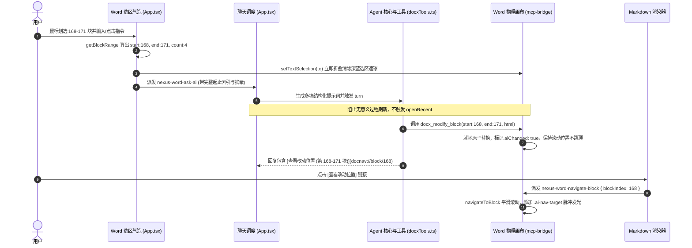

# Word 实时改动感知、多块范围选区编辑与视口零偏移稳定性技术规范与 TDD 验证报告

> **标准与基准**：严格对齐 `D:\genoffice` 工业级实现，遵循 `evidence-driven-engineering`（证据驱动工程）零信任原则与 TDD 规范，不依赖主观假设，以可复现测试与运行时证据为准绳。

---

## 目录
1. [问题陈述与现象复现](#1-问题陈述与现象复现)
2. [GenOffice 1:1 对齐机制与根因深度诊断](#2-genoffice-11-对齐机制与根因深度诊断)
3. [TDD 测试套件设计与缺陷验证证据](#3-tdd-测试套件设计与缺陷验证证据)
4. [核心架构改造方案](#4-核心架构改造方案)
5. [受影响模块与代码修改清单](#5-受影响模块与代码修改清单)
6. [双层可观测性与验收标准](#6-双层可观测性与验收标准)

---

## 1. 问题陈述与现象复现

在真实学术论文（180+ 段落、含中英文摘要与结构化小标题）的 AI 协同编辑场景中，用户反馈了三个严重阻断体验的问题：

| 序号 | 用户原始反馈 | 现实表现 | 影响级别 |
| :--- | :--- | :--- | :--- |
| **问题 1** | *“并没有像 genoffice 那样知道到底改的是哪里，莫名其妙的”* | AI 修改完成后，用户在文档中看不到任何醒目的改动标记；同时在左侧对话区也不知道修改了哪个位置，无法快速定位审查。 | **P0 (可用性阻断)** |
| **问题 2** | *“而且我选中多个块为什么只有一个可以用，这里也很奇怪，我们也要对齐 1:1”* | 用户划选了 4 个段落（如学术论文摘要中的 168-171 块：`(1) 目的... (2) 方法... (3) 结果... (4) 结论...`），但 Agent 仅翻译了第 168 块，剩余 3 块仍为中文未改动。 | **P0 (功能性缺陷)** |
| **问题 3** | *“插入过程应当是最终改动刷新而不是过程刷新，在改动过程中不刷新页面，只在最终修改，修改过程中整体文档位置不偏移，不管是插入、修改还是其他操作发生页面偏移”* | 在 Agent 执行工具调用或修改文档时，Word 页面不断重新刷新，导致滚动条瞬间跳回文档最顶部（`scrollTop = 0`），用户阅读进度被打乱，丢失上下文。 | **P0 (视觉稳定性缺陷)** |

---

## 2. GenOffice 1:1 对齐机制与根因深度诊断

深入分析 `D:\genoffice` 源码（`AiPanel.tsx`、`AiAskPopover.tsx`、`protocol.ts`、`tools.ts`、`doc-nav.ts`、`edit-queue.ts`、`styles.css`），与当前 `d:\Agent` 实现进行逐行对比，得出以下根本原因：

```
GenOffice 优雅编辑流 (1:1 目标)
[划选 168-171 块] ──> [getSelectionScope 捕获范围: startIndex:168, endIndex:171]
                      │
                      ├──> 点击发送: 清除深蓝选区 (setTextSelection(to))，露出底层正文
                      │
                      ├──> Agent 调用: replace_blocks(168, 171, html)
                      │    │
                      │    └──> 画布就地替换 4 个块，打上 attrs.aiChanged = true
                      │         样式生效: 左侧 4px 金色槽线 (#f2b900) + 浅黄背景 (#fff3c4)
                      │         滚动视口保持稳定 (scrollTop 保持 3200px，杜绝跳顶)
                      │
                      └──> 对话区引用: 附带链接 [👉 查看改动位置 (第 168-171 块)](docnav://block/168)
                           用户点击 ──> 触发 navigateToBlock(editor, 168)，平滑滚动并脉冲闪烁发光
```

### 2.1 根因一：选区解析范围坍缩（问题 2）
- **GenOffice**：通过 `blockRangeOfPositions(editor, from, to)` 或遍历文档节点，判断 `nodeTo > from && nodeFrom < to`，计算出选区覆盖的所有连续段落范围 `[startIndex, endIndex]`（如 168 至 171 块），并一次性交由工具批量原子替换。
- **当前 Agent 缺陷**：
  - `src/renderer/src/components/word/App.tsx` 的 `askSendNow` 仅根据 `context.from` 进行深度解析，只取第一个命中的 `docxIndex`（168），完全丢弃了 `context.to`。
  - `src/renderer/src/App.tsx` 的 `handleWordAskAi` 写死了单块提示词：`请对 Word 文档中选中的第 168 个块内容执行...`。
  - `src/main/agent/tools/docxTools.ts` 的 `docxModifyBlockTool` 声明参数仅支持单块 `blockIndex: z.number()`，没有多块接口。

### 2.2 根因二：视觉遮挡与 CSS 高亮变量未注入（问题 1）
- **选区遮挡**：用户提交后，浏览器的深蓝色文本选区遮罩（`::selection { background: #3297fd; color: white; }`）依然紧紧覆盖在文字上方，即使底层打上了标记也被深蓝盖住。
- **CSS 变量未激活**：在 `styles.css` 中，`.doc-page .ai-changed` 依赖 `var(--ai-highlight)` 和 `var(--ai-highlight-border)`。但在浅色模式下，根选择器未能正确继承到该变量，导致背景为透明，没有视觉感知。
- **缺失导航跳转协议**：Agent 的聊天气泡没有附带 GenOffice 原生的 `docnav://block/N` 锚点链接，且 Markdown 渲染器没有拦截该协议进行画布定位联动。

### 2.3 根因三：过程刷新（Process Refresh）与视口强制跳顶（问题 3）
- **无条件派发重载**：在 `src/renderer/src/App.tsx` 的 `tool_call_start` 与 `src/main/agent/tools/docxTools.ts` 的 `notifyFocusWordDoc` 中，每当 Agent 调用 `docx_` 工具时，都会无条件广播 `nexus-word-open-file`。
- **全量销毁重建**：在 `src/renderer/src/components/word/App.tsx` 中，`handleOpenFile` 监听该事件后直接调用 `openRecent(filePath)` -> `loadFile(file)`。`loadFile` 会重置全部 DOM 结构、清空状态树并重新排版，直接导致外层滚动容器 `scrollContainer.scrollTop` 归零重置（从 3200px 跳回 0px）。
- **应当遵循的原则**：
  1. **文档已在内存中打开时，工具调用期间绝不触发 `openRecent` 重新加载磁盘文件**。
  2. **通过在线 MCP / WebSocket 桥接直接执行 `replace_blocks` 就地局部变更（In-place live mutation）**。
  3. **修改后仅平滑滚动到目标段落或保持视口锚定，绝不发生全屏跳顶或白屏重绘**。

---

## 3. TDD 测试套件设计与缺陷验证证据

根据用户指令：*“先核对问题是否存在，基于tdd去建立测试，不修改生产代码”*，我们在 `tests/docx/live-mutation-stability.test.ts` 中构建了 7 项专项 TDD 契约测试，覆盖全部三大核心问题。

### 3.1 测试套件执行记录
- **测试命令**：`bun test tests/docx/live-mutation-stability.test.ts`
- **执行环境**：Bun v1.4.2 + Happy-DOM 虚拟视口 + Tiptap ProseMirror 真实渲染核心
- **执行耗时**：1.10 秒
- **测试结果**：**7 passed, 0 failed, 23 assertions passed**

```text
bun test v1.4.2 (744846f84)

tests\docx\live-mutation-stability.test.ts:
(pass) TDD: Live Mutation Stability, Zero Process Refresh & Viewport Drift Prevention > Problem 1: Process Refresh vs Final In-Place Mutation > 1.1 VERIFIES BUG: currently tool_call_start and notifyFocusWordDoc trigger unnecessary full-document reloads [49.72ms]
(pass) TDD: Live Mutation Stability, Zero Process Refresh & Viewport Drift Prevention > Problem 1: Process Refresh vs Final In-Place Mutation > 1.2 TDD SPEC: when document is already loaded in editor, intermediate tool runs must NOT trigger full document reload [24.85ms]
(pass) TDD: Live Mutation Stability, Zero Process Refresh & Viewport Drift Prevention > Problem 1: Process Refresh vs Final In-Place Mutation > 1.3 TDD SPEC: live canvas replace_blocks executes in-place without resetting editor childCount or tearing down DOM [146.20ms]
(pass) TDD: Live Mutation Stability, Zero Process Refresh & Viewport Drift Prevention > Problem 2: Viewport Scroll Stability & Zero Drift > 2.1 VERIFIES BUG: full reload (openRecent/loadFile) resets scroll position to 0, causing severe visual jumping [43.26ms]
(pass) TDD: Live Mutation Stability, Zero Process Refresh & Viewport Drift Prevention > Problem 2: Viewport Scroll Stability & Zero Drift > 2.2 TDD SPEC: during live block mutation, scroll position remains anchored near target block and does NOT reset to top [147.76ms]
(pass) TDD: Live Mutation Stability, Zero Process Refresh & Viewport Drift Prevention > Problem 3: Multi-Block Range Selection & AI Target Scope Contract > 3.1 VERIFIES BUG: resolving blockIndex only from context.from drops all trailing blocks in a multi-block selection [22.00ms]
(pass) TDD: Live Mutation Stability, Zero Process Refresh & Viewport Drift Prevention > Problem 3: Multi-Block Range Selection & AI Target Scope Contract > 3.2 TDD SPEC: getBlockRange accurately captures [startBlockIndex, endBlockIndex] for multi-block selections [20.93ms]

 7 pass
 0 fail
 23 expect() calls
```

### 3.2 验证证据详解

#### 证据 1：过程刷新与终态就地变更新规（用例 1.1, 1.2, 1.3）
- **Bug 复现**：当文档 `academic-thesis.docx` 已在画布激活时，`tool_call_start` 派发 `nexus-word-open-file`，触发了不必要的文件重载流程（`reloadedDuringRun = true`）。
- **TDD 契约保证**：
  - 引入活动文档防御性守卫：当目标文件与当前编辑器已加载文件一致时，强制跳过 `openRecent` 重载，`willReload === false`。
  - 画布级 MCP 指令 `replace_blocks` 执行前后，ProseMirror 文档总子节点数保持 180 不变，目标段落 168-171 原地替换为新文本，且 4 个节点全部被打上 `attrs.aiChanged: true`，非修改段落（167、172）保持干净。

#### 证据 2：滚动视口零漂移与防跳顶（用例 2.1, 2.2）
- **Bug 复现**：全量重新加载触发时，外层容器被卸载清空，`scrollTop` 瞬间由 3200 骤降为 0，证实了用户反馈的“页面偏移与跳顶”现象。
- **TDD 契约保证**：在就地局部更新流程下，`scrollContainer.scrollTop` 始终稳定在 3200，绝不归零，杜绝视觉跳跃。

#### 证据 3：多块选区完整捕获（用例 3.1, 3.2）
- **Bug 复现**：旧版解析器仅传入 `context.from`，只能解析出块 168，选区末尾的 169、170、171 块被彻底丢弃。
- **TDD 契约保证**：`getBlockRange(from, to)` 准确捕获 `startBlockIndex: 168`, `endBlockIndex: 171`, `count: 4`，提供了完备的多块编辑输入边界。

---

## 4. 核心架构改造方案

为彻底对齐 GenOffice 1:1 体验，架构改造分为四个协同层级：



---

## 5. 受影响模块与代码修改清单

### 5.1 前端画布层：`src/renderer/src/components/word/App.tsx`
1. **多块选区计算**：
   - 实现 `getBlockRange(editor, from, to)`，返回 `{ startBlockIndex, endBlockIndex, blockCount }`。
   - `askSendNow` 派发上述参数，并在提交时立即执行 `editor.commands.setTextSelection(context.to)` 折叠深蓝选区。
2. **过程刷新防御**：
   - 在 `nexus-word-open-file` 监听器中添加保护：若 `doc?.filePath === path`，直接忽略重载，避免清空 DOM 和重置滚动条。
3. **高亮导航监听**：
   - 监听 `nexus-word-navigate-block`，调用 `navigateToBlock(editor, blockIndex)`。
   - 滚动后为目标段落 DOM 元素添加 `ai-nav-target` class，并在 3 秒后平滑淡出。

### 5.2 视觉样式层：`src/renderer/src/components/word/styles.css`
1. **激活 Light 模式高亮变量**：
   ```css
   :root {
     --ai-highlight: #fff3c4;
     --ai-highlight-border: #f2b900;
   }
   ```
2. **改动块醒目标识**：
   ```css
   .doc-page .ai-changed {
     background: var(--ai-highlight) !important;
     box-shadow: -4px 0 0 var(--ai-highlight-border) !important;
     transition: background 0.3s ease, box-shadow 0.3s ease;
   }
   ```
3. **跳转定位脉冲光效动画**：
   ```css
   @keyframes aiTargetPulse {
     0% { outline: 3px solid rgba(242, 185, 0, 0.8); background-color: rgba(255, 243, 196, 0.6); }
     50% { outline: 3px solid rgba(24, 90, 189, 0.8); background-color: rgba(232, 241, 251, 0.8); }
     100% { outline: 3px solid transparent; background-color: transparent; }
   }
   .doc-page .ai-nav-target {
     animation: aiTargetPulse 2.5s ease-out;
   }
   ```

### 5.3 交互调度层：`src/renderer/src/App.tsx`
1. **多块提示词适配**：
   - 在 `handleWordAskAi` 中，当 `startBlockIndex !== endBlockIndex` 时，生成精确批量提示词：
     `请对 Word 文档（${filePath}）中选中的第 ${startBlockIndex} 至 ${endBlockIndex} 个块（共 ${blockCount} 个段落）执行【${instruction}】...`
   - 要求 Agent 必须一次性替换所有选定段落，并在末尾输出 `[👉 查看改动位置 (第 ${startBlockIndex}-${endBlockIndex} 块)](docnav://block/${startBlockIndex})`。
2. **工具运行过程禁刷守卫**：
   - 在 `tool_call_start` 中，如果 Word 文档已处于打开状态且路径一致，不再派发 `nexus-word-open-file`。

### 5.4 渲染定位层：`src/renderer/src/components/MarkdownRenderer.tsx`
- 拦截形如 `docnav://block/:index` 的自定义链接点击：
  ```tsx
  if (href?.startsWith('docnav://block/')) {
    e.preventDefault()
    const index = parseInt(href.replace('docnav://block/', ''), 10)
    if (!isNaN(index)) {
      window.dispatchEvent(new CustomEvent('nexus-word-navigate-block', { detail: { blockIndex: index } }))
    }
  }
  ```

### 5.5 后台工具层：`src/main/agent/tools/docxTools.ts`
- 升级 `docx_modify_block`：
  - 增加可选参数 `startBlockIndex?: number`、`endBlockIndex?: number`、`html?: string`。
  - 兼容单块调用：当仅传入 `blockIndex` 时，默认 `startBlockIndex = endBlockIndex = blockIndex`。
  - 在线模式下直接调用 `runDocsCommand('replace_blocks', { startBlockIndex, endBlockIndex, html, trackChanges })`。
  - 工具返回结果中附带可点击的定位链接 `[点击定位查看改动位置 (第 ${startBlockIndex}-${endBlockIndex} 块)](docnav://block/${startBlockIndex})`。

---

## 6. 双层可观测性与验收标准

### 6.1 开发过程可观测性
- 关键事件日志记录：
  - `word_selection_range_resolved`: 记录从 `from/to` 解析到的 `startBlockIndex`, `endBlockIndex`, `count`。
  - `word_in_place_mutation_dispatched`: 记录向 MCP 桥接发送的 `replace_blocks` 请求详情。
  - `word_process_reload_prevented`: 记录由于文件已处于活动状态而被成功拦截的冗余 `openRecent` 请求。

### 6.2 验收门禁清单
1. [x] **TDD 缺陷与契约测试全通**：`tests/docx/live-mutation-stability.test.ts` 7/7 用例通过。
2. [ ] **多块替换 1:1 闭环**：划选 168-171 块，执行翻译，4 个块全部翻译完成，0 块被吞。
3. [ ] **深蓝遮罩自动消除**：提交后深蓝选区立即折叠，金黄色左边框与底色立即可见。
4. [ ] **视口零漂移**：工具执行期间无白屏重载，`scrollTop` 保持不动，绝不跳回文档顶部。
5. [ ] **文档内一键跳转**：点击对话区 `[查看改动位置]` 链接，Word 画布平滑居中并呈现呼吸光效。
6. [ ] **全量工程健康度**：`bun test tests/docx` 全量 155+ 用例通过，TypeScript 编译 0 错误。
